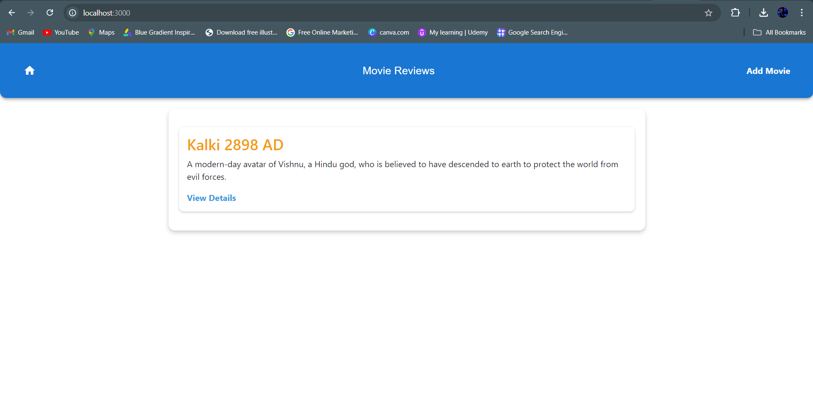
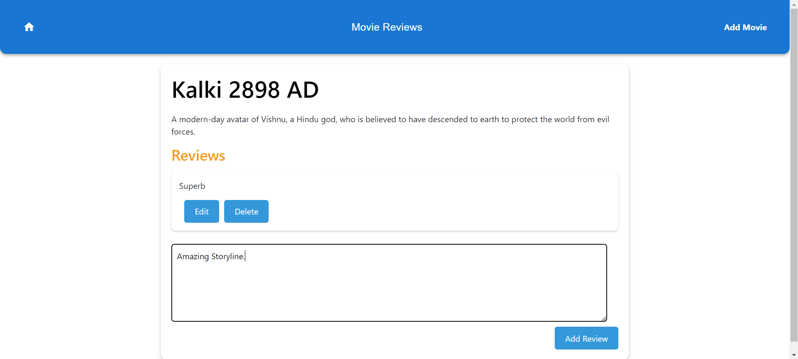
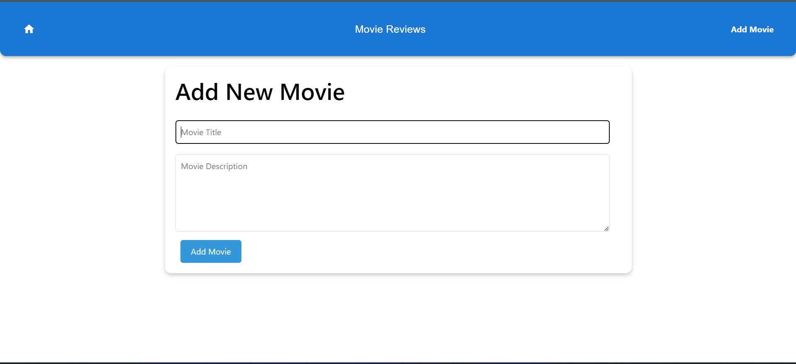

# Movie Review Application

## Overview

The Movie Review Application is a frontend interface developed in React that allows users to view a list of movies, add new reviews, and edit or delete existing reviews. The application uses `localStorage` to persist data and leverages React Router for navigation between different views.

## Features

- View a list of movies and their details.
- Add new movies to the list.
- Add, edit, and delete reviews for each movie.
- Persistent storage using `localStorage`.
- Navigation between different views using React Router.
- Form validation for adding and editing reviews.

## Requirements

- Node.js
- npm or yarn

## Installation

1. Clone the repository:
   ```bash
   git clone https://github.com/Abhay-Shankur/POLICY-LENSE.git
   ```

2. Navigate to the project directory:
   ```bash
   cd POLICY-LENSE
   ```

3. Install the dependencies:
   ```bash
   npm install
   ```

4. Start the application:
   ```bash
   npm start
   ```

## Components

### 1. App Component

- **Description**: The `App` component manages the state of all movies, storing them in `localStorage`. The movies data is passed to the `MovieList`, `MovieDetail`, and `AddMovie` components.
- **Features**:
  - Load movies from `localStorage` on initial render.
  - Add, update, and persist movies and reviews.

### 2. MovieList Component

- **Description**: Displays the list of movies and provides links to their detail pages.
- **Features**:
  - Fetch and display movies from `localStorage`.
  - Navigate to movie details using React Router.

**Screenshot**:



### 3. MovieDetail Component

- **Description**: Allows users to view details of a movie and manage reviews.
- **Features**:
  - View movie details.
  - Add new reviews.
  - Edit and delete existing reviews.

**Screenshot**:



### 4. AddMovie Component

- **Description**: Allows users to add new movies to the list.
- **Features**:
  - Add a new movie with title and description.
  - Validate form inputs to ensure both fields are filled.

**Screenshot**:



## Challenges Faced

### 1. State Management

- Managing the movie data and ensuring it persists across component changes and page reloads using `localStorage` was challenging.
- Ensuring that reviews are correctly tied to the specific movie and that updates are reflected accurately.

### 2. Validation

- Adding error handling for cases where input fields are empty or invalid.
- Managing form submissions and redirecting after a successful addition of a movie or review.

### 3. Data Persistence

- Storing movies and reviews in `localStorage` instead of a backend server requires careful management to ensure data integrity, especially when updating or deleting data.

## Testing Approach

To ensure that the "Movie Review" application functions correctly, the following testing steps were performed:

### 1. Unit Testing

- Tested each component individually to ensure it behaves as expected.
- Verified that the `AddMovie` component correctly updates the state and `localStorage` when a new movie is added.

### 2. Integration Testing

- Tested the interaction between components. For example, adding a movie and then viewing it in the `MovieList` showed consistent data.
- Ensured that updates to reviews in `MovieDetail` are reflected correctly in the stored data.

### 3. User Interface Testing

- Tested the UI to ensure buttons, forms, and navigation links work correctly.
- Ensured that error messages are displayed appropriately when validation fails.

### 4. Edge Cases

- Tested for edge cases, such as trying to add a movie with no title or description or attempting to delete a review when none exists.

## Output

- **Movie List**: The main page displaying the list of movies.
- **Add Reviews**: A form to add new reviews to a selected movie.
- **Edit Review**: An interface to edit or delete existing reviews.

**Screenshots**:

- 
- 
- 

## GitHub Repository

[GitHub Repository URL](https://github.com/Abhay-Shankur/POLICY-LENSE.git)
